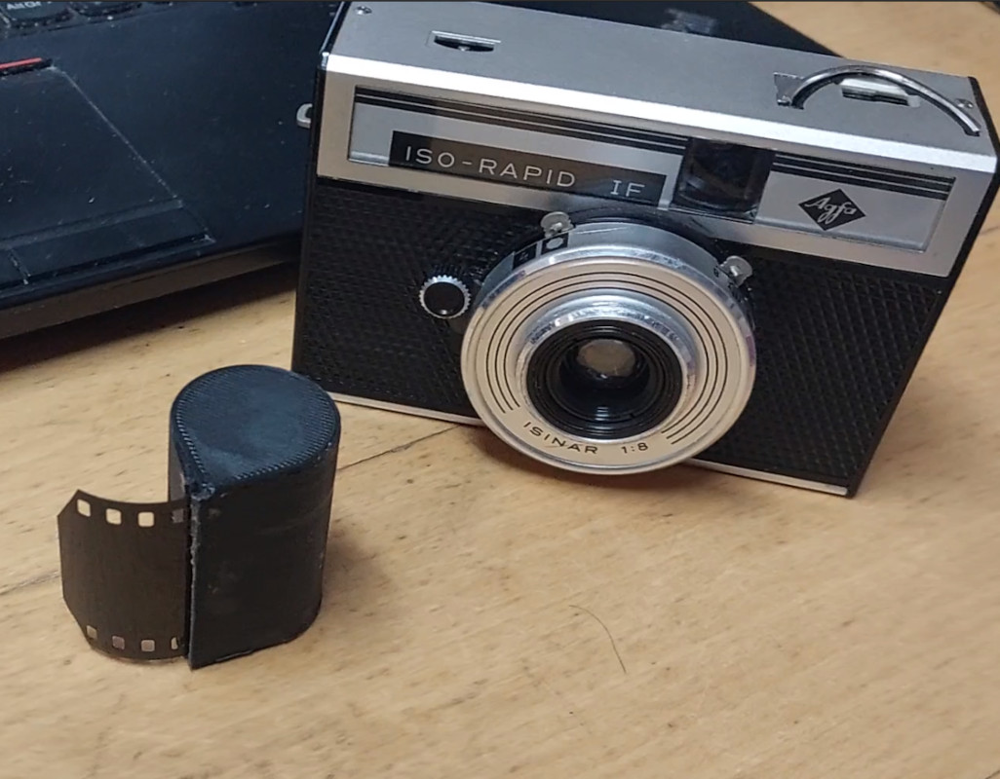

# Cartridge For AGFA Rapid cameras
A 3D-printable film cartridge for AGFA Rapid film cameras

The Rapid film system was AGFA's answer to Kodak's 126 cartridge back in the 1960s, a wuick-loading 35mm film format. It was based on an earlier AGFA cartridge, with the addition of a tab to select film speed.

This is a 3D-printable Rapid cartridge, which can be loaded with 35mm film. The STL is for an ISO 100 cartridge, while examining the OpenSCAD file you'll find any of the available ISO settings can be selected.

The cartridge and lids should be printed, then a set of two felt light seals should be glued along the opposite sides of the film opening. I used the soft side of a piece of black velcro, but a strip of black felt can also be used. Use a knife blade to keep the two felt pieces from sticking to each other. Once the glue has set, the felt can be trimmed at each end and the end pieces can be glued into place.

The cartridge should be loaded with a piece of 35mm film about 70cm long, on which should fit the 12 exposures of a Rapid film. The film has to coil up in the cartridge, so it can't take much more film than this. 

Comprehensive information on AGFARapid film can be found on [this German Wikipedia page](https://de.wikipedia.org/wiki/Agfa_Rapid)

## Licence

This model is licensed under the [Creative Commons Attribution Share Alike 4.0 International licence](license.md).
